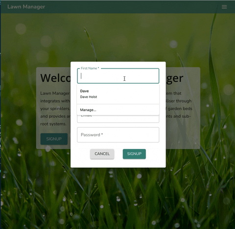

# Lawn Manager Client
This is the client web-app designed to interact with the Lawn Manager Server over the GraphQL API. It is designed to be deployed to a Herokuish server using the mars build pack. Lawn Manager allows users to setup their properties, connect juiceBox fertigation devices and openSprinkler irrigation controllers to allow autonomous fertilising of lawns and garden beds. Through this client users can calculate fertigation recipes and run them on selected zones.

Lawn Manager Server: https://github.com/daveholst/lawn-man-server
juiceBox: https://github.com/daveholst/juice-box

## Table of Contents:

- [Live Deploy](#Live-Deploy)
- [Screenshots](#Screenshots)
- [Technology Stack](#Technology-Stack)
- [License](#License)
- [Tests](#Tests)
- [Questions](#Questions)

## Live Deploy

A live deploy of this app can be found on Digital Ocean at: https://lawn-man.holst.club/

## Screenshots

## Technology Stack

- React: https://reactjs.org/
- Material-UI: https://material-ui.com/
- mars buildpack: https://github.com/mars/create-react-app-buildpack
- create-react-app: https://create-react-app.dev/
- apollo client: https://www.apollographql.com/docs/react/
- dokku: https://dokku.com/
- WesBos Linting Config: https://github.com/wesbos/eslint-config-wesbos

## License

This project is under an MIT license.
## Tests

No tests have been written for this software.

## Questions

If you have any further questions you can get in contact with the creator through the following methods:

- https://github.com/daveholst/
- contact@daveholst.dev
